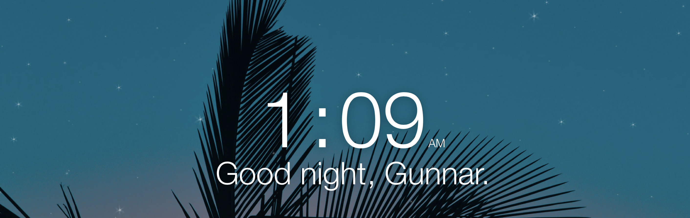

Starry Nights Widget
---

Made for [Übersicht](http://tracesof.net/uebersicht/)

## How to install

Just drop the folder `starry-nights.widget` into your widgets folder for Übersicht

## Appearance & Options

It's super simple, in the beginning of the `starry-nights.js` file there are a few setting, and here they are and what they do:

* `background` Name of the image that is located in `starry-nights.widget` folder
* `intensity` Brightness of the stars `0` through `1`

How to change the image of stars?

* Create your own landscape of stars, with what ever program you desire.
* Name the image `bgstar.png` or change this image name in the settings
* Place the image in the same folder as `starry-nights.js`

*at the moment the starts start to appear at 7pm and disappear at 6am, peak hours are 12 & 1. There is no way to configure this, hopefully soon you will be able to.

## Tip

The background image doesnt need to be stars! It can be ghosts, or monsters, or even big letters that scream GO TO SLEEP! The way this works is the later it is at night the higher the images opacity is, soooo the late at night it is the more the image shows up.

## Credits

Gunnar Bjorkman, ...yeah so far its just me
